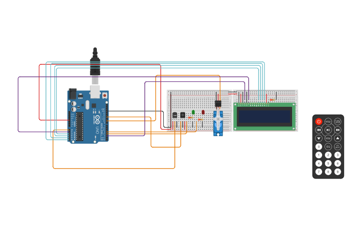

# Parcial 1 SPD

## Integrantes
- Angel Zabala

## Proyecto: Montacargas.

## Descripcion

El objetivo de este proyecto es diseñar un sistema de incendio utilizando Arduino que pueda
detectar cambios de temperatura y activar un servo motor en caso de detectar un incendio.
Además, se mostrará la temperatura actual y la estación del año en un display LCD.

## Funcion principal

Esta funcion nos permite saber que estacion del año es, y en el caso que no sea ninguna estacion nos lo notifica, al superar los valores que se identifican como temperatura sin riesgo se inicia el protocolo de riesgo de incendio

~~~ C
int designarEstacion(int rango, int min, int max, int invierno, int otonio, int primavera, int verano)
{
  int retorno = 0;
   lcd.clear();
  lcd.print(rango);
  lcd.print(" C");
  if(rango >= min && rango < max)
        {
          if(rango <= invierno)
          {
            retorno = 1;
          }
          else if(rango <= otonio)
          {
            retorno = 2;
          }
          else if(rango <= primavera)
          {
            retorno = 3;
          }
          else if(rango <= verano)
          {
            retorno = 4;
          }
		}
  else if(rango >= max)
  {
    retorno = -1;
    lcd.clear();
    lcd.print("incendio!!!!!");
    for(int i = 0; i < 180; i++)
    {
      myServo.write(i);
      i = i + 9;
      digitalWrite(rojo, HIGH);
      lcd.display();
      
      delay(50);
      digitalWrite(rojo, LOW);
      lcd.noDisplay();
      delay(50);
      
    }
    lcd.display();
    lcd.clear();
    myServo.write(0);
  }
  
  return retorno;
}
  ~~~
  
  ## 🤖 link al proyecto
  - [proyecto](https://www.tinkercad.com/things/3Ez6lYRTPvp)
